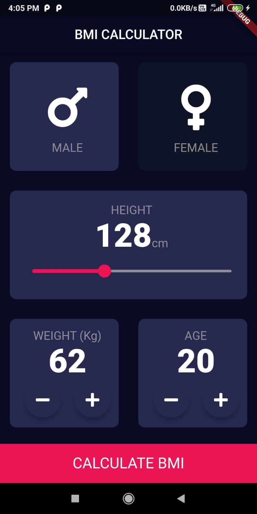
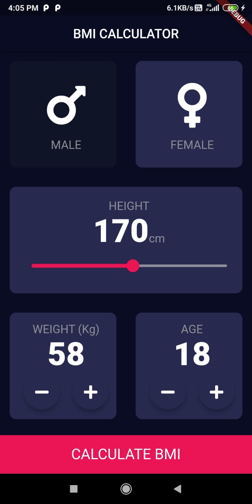

# BMI Calculator

**To ensure good health conditions**

Check your body health with BMI calculations.

## Platform

- Tested and optimized for Android

## Get the APK

- [**Download APK**](https://drive.google.com/file/d/1IuDEOHG5q-tq_1FoSRq1SrQ8odR6HJMX/view?usp=sharing)

<table>
  <tr>
    <td>
      
    </td>
    <td style="padding-left: 20px;">
      
    </td>
  </tr>
</table>  

## About

### BMI CALCULATOR

Simple inputs like body weight, age, gender are used to predict underweight or overweight or normal body weight using the BMI (body mass index) formula.

## Features

- Calculate BMI with ease: Input your body weight, age, and gender, and let our app do the rest. It will provide you with a quick assessment of your body weight status.
- Stay informed: Get instant feedback on whether you're underweight, overweight, or within a healthy weight range.
- User-friendly interface: Our app is designed with simplicity in mind, making it accessible for users of all ages.
- Tested and optimized for Android: Enjoy a seamless experience on your Android device.

## How to Use

1. Download the APK using the link provided above.
2. Install the app on your Android device.
3. Open the app and enter your body weight, age, and gender.
4. Receive instant feedback on your BMI and body weight status.
   

## About BMI

The Body Mass Index (BMI) is a valuable tool for assessing your overall health. It calculates your BMI based on your body weight and height, helping you understand if you are underweight, overweight, or within a healthy weight range. It's a simple yet effective way to monitor your well-being.
